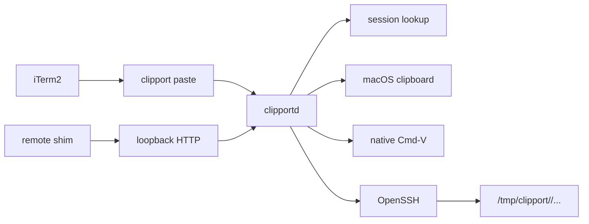

# Clipport Architecture

Contributor map for the Clipport codebase. Keep this file current when runtime
behavior, file layout, security boundaries, or install behavior changes.

Last updated: 2026-04-29

## 1. Project Structure

```text
clipport/
├── cmd/
│   ├── clipport/          # CLI used by iTerm and support commands
│   └── clipportd/         # local daemon entrypoint
├── internal/
│   ├── clipboard/          # osascript, pbpaste, pngpaste integration
│   ├── config/             # TOML config and host resolution
│   ├── daemon/             # paste flow, socket protocol, shim HTTP API
│   ├── doctor/             # health checks
│   ├── onboard/            # config TUI built from ~/.ssh/config
│   ├── registry/           # route and transfer cache
│   ├── remote/             # route probing, SSH upload, remote paths
│   ├── shims/              # remote wl-paste/xclip scripts
│   ├── shimsetup/          # shim setup and uninstall
│   ├── sshsetup/           # managed OpenSSH config blocks
│   ├── terminal/           # active iTerm session lookup
│   ├── testpaste/          # diagnostic upload command
│   ├── token/              # bearer token helpers
│   └── uninstall/          # local artifact removal
├── ARCHITECTURE.md
├── README.md
├── install.sh
├── clipport.example.toml
└── .github/workflows/go.yml
```

Runtime behavior belongs in `internal/daemon`. Setup, diagnostics, shims, and
uninstall code should stay outside the main paste path.

## 2. System Diagram



Two paths exist:

- `clipport paste` over a local Unix socket for normal iTerm paste.
- Remote `wl-paste`/`xclip` shims over SSH `RemoteForward` plus loopback HTTP.

## 3. Core Components

### 3.1 CLI

Path: `cmd/clipport`

The CLI is the iTerm-facing process. It sends JSON requests to the daemon and
prints the daemon response.

Commands handled here:

- `paste`
- `session register`
- `status`
- `doctor`
- `test-paste`
- `onboard`
- `ssh install-*`
- `shims setup|uninstall`
- `uninstall`

Paste stdout contract:

- remote text: print text
- remote image: print path only
- local paste: print nothing

### 3.2 Daemon

Paths: `cmd/clipportd`, `internal/daemon`

The daemon owns state and side effects:

- Unix socket listener
- paste orchestration
- registered session bindings
- recent transfer history
- clipboard reads
- route choice
- image upload
- optional shim HTTP API

Main entry points:

- `Server.Handle`
- `Server.Paste`
- `Server.Listen`
- `Server.ListenHTTP`

### 3.3 Terminal Sessions

Path: `internal/terminal`

The daemon receives `TERM_SESSION_ID` from the CLI. If the session has been
registered, that binding wins. Otherwise the daemon uses active iTerm metadata
and configured host matching.

Resolution order:

1. registered session key
2. detected host matched through config
3. active iTerm session lookup fallback
4. native paste for known local sessions
5. paste-unavailable error for unresolved remote sessions

### 3.4 Clipboard

Path: `internal/clipboard`

Clipboard detection uses:

- `osascript -e "clipboard info"` for type detection
- `pngpaste -` for image bytes
- `pbpaste` for text bytes

Images are preferred over text when both are available.

### 3.5 Config And Routes

Paths: `internal/config`, `internal/remote`

Config terms:

- machine: one remote filesystem, represented by `config.Host`
- route: one SSH path to that machine, represented by `config.Route`

Routes are sorted by ascending `priority`. `remote.Manager` caches the best
known route for each machine. Probing uses a quick TCP check when possible and
falls back to `ssh ... true`.

Upload transport is OpenSSH. Do not add a separate SSH transport unless there is
a clear reason.

## 4. Data Flows

### 4.1 Local Paste

1. iTerm runs `clipport paste`.
2. CLI sends `Request{Command: "paste", SessionKey: TERM_SESSION_ID}`.
3. Daemon resolves the session as local.
4. Daemon invokes native Cmd-V.
5. CLI prints nothing.

### 4.2 Remote Text Paste

1. iTerm runs `clipport paste`.
2. Daemon resolves the session to a machine.
3. Clipboard provider selects text and runs `pbpaste`.
4. Daemon returns `Response{Text: ...}`.
5. CLI prints the text.

### 4.3 Remote Image Paste

1. iTerm runs `clipport paste`.
2. Daemon resolves the session to a machine.
3. Clipboard provider selects image data and runs `pngpaste -`.
4. Route manager chooses a route.
5. Uploader runs remote `mkdir -p <dir> && cat > <path>` through SSH.
6. Daemon returns `Response{Path: ...}`.
7. CLI prints the path.

Remote image path format:

```text
/tmp/clipport/<local-user>/clipboard-YYYYMMDD-HHMMSS.microseconds.png
```

The machine name is not in the path. The file is already on the target remote
filesystem.

### 4.4 Shim Clipboard Read

1. Remote program calls `wl-paste` or `xclip`.
2. Shim reads `~/.config/clipport/token`.
3. Shim calls the local daemon through SSH `RemoteForward`.
4. Daemon checks `Authorization: Bearer <token>`.
5. Daemon returns clipboard bytes as `text/plain; charset=utf-8` or
   `image/png`.

This path is separate from `clipport paste`.

## 5. State And Storage

User config:

```text
~/.config/clipport/config.toml
```

Install manifest:

```text
~/.config/clipport/install.toml
```

The manifest records local install artifacts for uninstall. It must not contain
secrets.

Shim token, local and remote:

```text
~/.config/clipport/token
```

Permissions must be `0600`.

Runtime paths:

```text
/tmp/clipport/<uid>/clipportd.sock
/tmp/clipport/<local-user>/clipboard-*.png
/tmp/clipportd.out.log
/tmp/clipportd.err.log
```

`internal/registry` stores route and transfer hints used by `status` and
diagnostics.

## 6. External Integrations

- iTerm2: key binding and active session metadata
- macOS clipboard: `osascript`, `pbpaste`
- Homebrew: installs `pngpaste` and Go when needed
- OpenSSH: uploads, SSH config, `RemoteForward`, aliases
- launchd: daemon lifecycle

OpenSSH owns SSH behavior. Clipport should not reimplement `Port`,
`ProxyJump`, `ProxyCommand`, identity handling, or connection reuse.

## 7. Install And Runtime

`install.sh`:

- builds `clipport` and `clipportd`
- installs them to `~/.local/bin` by default
- runs onboarding when config is missing
- starts `clipportd` through launchd
- can add iTerm key binding
- can add SSH session hooks
- writes `~/.config/clipport/install.toml`

Daemon runtime:

- Unix socket is local-only
- HTTP API, when enabled, binds only to loopback
- uploaded files stay under `/tmp/clipport/...`

CI runs `gofmt`, `go test ./...`, and `go vet ./...`.

## 8. Security Boundaries

- HTTP endpoints bind only to loopback.
- Shim HTTP requires bearer token auth.
- Tokens live in `~/.config/clipport/token` with `0600`.
- Shim executables read tokens from disk; they do not embed token literals.
- Upload paths stay under `/tmp/clipport/...`.
- SSH config edits stay inside marked Clipport blocks.
- Host aliases and generated SSH config content must be shell-safe.

The normal paste path exposes no network listener.

## 9. Development And Testing

Required before claiming code changes are done:

```bash
gofmt -w <changed go files>
go test ./...
go vet ./...
```

Useful test targets:

- CLI stdout: `cmd/clipport`
- paste orchestration: `internal/daemon`
- clipboard selection: `internal/clipboard`
- remote upload paths: `internal/remote`
- config resolution: `internal/config`
- onboarding and SSH config edits: `internal/onboard`, `internal/sshsetup`
- shim auth and setup: `internal/shims`, `internal/shimsetup`,
  `internal/daemon/http.go`
- uninstall cleanup: `internal/uninstall`

For paste changes, test stdout and side effects. Noisy stdout is a regression
even if upload succeeds.

## 10. Design Decisions

- Keep the CLI thin.
- Keep runtime state in the daemon.
- Keep machine and route separate.
- Keep remote image output path-only.
- Keep local paste silent.
- Use `pngpaste` instead of decoding clipboard images in Go.
- Use OpenSSH as transport.
- Do not add config knobs without a concrete use case.

## 11. Possible Future Work

- image formats beyond PNG output
- clearer session matching diagnostics
- better route-health output in `status`
- integration tests for installer-created iTerm and SSH artifacts
- cleanup policy for old `/tmp/clipport/...` uploads

## 12. Project Identification

Project: Clipport

Repository: `git@github-personal:arihantsethia/clipport.git`

Platform: macOS, iTerm2, OpenSSH

Language: Go

## 13. Glossary

Machine:
One logical remote filesystem.

Route:
One SSH path to a machine.

Session binding:
Mapping from iTerm session key to configured machine.

Shim:
Remote `wl-paste` or `xclip` replacement that calls back to the local daemon.

Paste contract:
Remote text prints text, remote image prints only a path, local paste prints
nothing.
