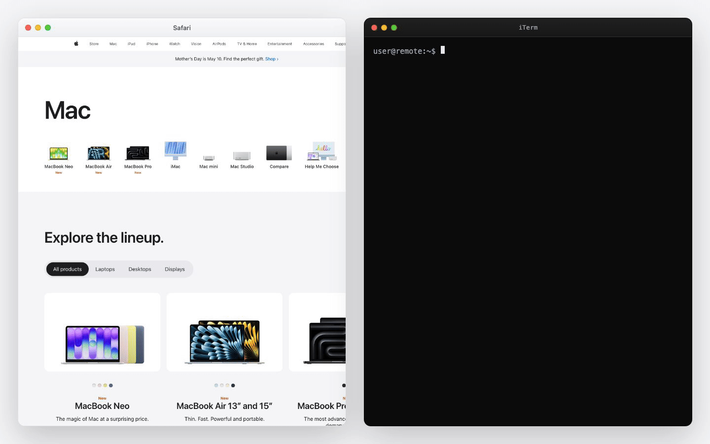

<div align="center">
  
  <h1>clipport</h1>
  <p><strong>Paste local text and images into remote iTerm sessions.</strong></p>
  <p>
    <a href="LICENSE"></a>
    
    
    
  </p>
</div>

Clipport makes one iTerm paste shortcut work across local and SSH shells. It
detects the active iTerm session, reads the Mac clipboard, and chooses the
right paste behavior.

| Session | Clipboard | Terminal receives |
|---|---|---|
| local | text or image | native paste; `clipctl paste` prints nothing |
| remote | text | clipboard text |
| remote | image | remote image path under `/tmp/clipport/...` |

## Demo



Remote image example:

```text
/tmp/clipport/yourname/clipboard-20260428-132708.241851.png
```

Use Clipport when a remote process needs the thing on your Mac clipboard: a
screenshot, an image, or plain text pasted through the same terminal shortcut.

## Use Cases

Clipport is useful when the remote shell needs local clipboard state:

- paste a screenshot path into a VM shell
- hand a local image to a remote command
- avoid one-off `scp` for clipboard images
- keep one paste shortcut for local and SSH shells

## Requirements

- macOS
- iTerm2
- Homebrew
- passwordless SSH to each remote machine
- writable `/tmp` on each remote machine

## Install

```bash
curl -fsSL https://raw.githubusercontent.com/arihantsethia/clipport/main/install.sh | sh
```

The installer builds `clipctl`, `clipportd`, and the Clipport menu bar app.
It records local install paths in `~/.config/clipport/config.toml`. It does
not start Clipport. It reports `installed` for a new install and `upgraded`
when it finds an existing config, binary, app bundle, or launchd plist.

If `~/.local/bin` is not on your `PATH`, the installer prints the export line
to add.

## Setup

Build host config from `~/.ssh/config`:

```bash
clipctl onboard
```

Onboarding lets you choose SSH hosts, configure the iTerm paste shortcut, and
install OpenSSH `LocalCommand` hooks for automatic session matching.

Start Clipport:

```bash
clipctl start
```

Check the install:

```bash
clipctl doctor
```

Then open an SSH session in iTerm, copy text on your Mac, and press the
Clipport paste shortcut. Text should appear at the remote prompt.

For images, copy an image or screenshot and press the same shortcut. The remote
prompt receives a path like:

```text
/tmp/clipport/yourname/clipboard-20260428-132708.241851.png
```

Test remote image upload without changing your clipboard:

```bash
clipctl test-paste --host <machine>
```

## Behavior

iTerm runs this command behind the paste shortcut:

```bash
clipctl paste
```

Stdout is strict because iTerm inserts stdout into the terminal:

- local paste prints nothing
- remote text prints the clipboard text
- remote image upload prints only the remote path

Remote uploads always use paths under:

```text
/tmp/clipport/<local-user>/
```

## Configuration

A machine is one remote filesystem. A route is one SSH path to that machine.
OpenSSH still owns aliases, keys, proxies, and connection behavior.

Rerun onboarding:

```bash
clipctl onboard
```

List SSH hosts seen by onboarding:

```bash
clipctl onboard --list
```

Local install settings and host routes live in:

```text
~/.config/clipport/config.toml
```

The file contains no secrets.

## Session Matching

Clipport maps the active iTerm session to a configured machine. OpenSSH
`LocalCommand` hooks make that mapping explicit. If hooks are not installed or
do not fire, terminal title detection and manual registration remain available.

Register the current iTerm session manually:

```bash
clipctl session register --machine <machine>
```

Show configured hosts, registered sessions, and recent transfers:

```bash
clipctl status
```

## Menu Bar

When started, the menu bar app supervises `clipportd`. It shows daemon health,
configured hosts, and shortcuts to restart Clipport, run `clipctl doctor`, and
open config or log files.

`clipportd` exits when the menu bar app exits. Choosing `Quit` stops the
daemon and exits Clipport. The menu bar app does not change the
`clipctl paste` stdout contract.

## Commands

```bash
# Paste entrypoint used by iTerm.
clipctl paste

# Start, stop, or restart the menu bar app and daemon.
clipctl start
clipctl stop
clipctl restart

# Health check.
clipctl doctor

# Status and recent transfers.
clipctl status

# Upload an embedded test PNG to a configured machine.
clipctl test-paste --host <machine>

# Update from the public installer source.
clipctl update
```

Debug paste failures:

```bash
clipctl --debug paste
```

## Remote Clipboard Shims

Shims are only for remote programs that call `wl-paste` or `xclip` directly.

Install shims for a configured machine:

```bash
clipctl shims setup --host <machine>
```

Both local and remote tokens live at:

```text
~/.config/clipport/token
```

Permissions are `0600`. Tokens are not embedded in executable scripts. The
local HTTP endpoint binds only to loopback.

Remove shims:

```bash
clipctl shims uninstall --host <machine>
```

Remove the remote token too:

```bash
clipctl shims uninstall --host <machine> --remove-remote-token
```

## Install Options

From a checkout:

```bash
./install.sh
```

Install binaries somewhere else:

```bash
CLIPPORT_BIN=/some/bin ./install.sh
```

Use a different iTerm key binding:

```bash
CLIPPORT_ITERM_KEY=<iterm-key-code> ./install.sh
```

Use a specific loopback HTTP address:

```bash
CLIPPORT_HTTP=127.0.0.1:18800 ./install.sh
```

## Update

```bash
clipctl update
```

`clipctl update` downloads the latest installer and applies it using the current
install settings.

Set `CLIPPORT_REF` to update from another branch or ref:

```bash
CLIPPORT_REF=<ref> clipctl update
```

## Uninstall

```bash
clipctl uninstall
```

Preview:

```bash
clipctl uninstall --dry-run
```

Remove local config, cache, token, and `/tmp/clipport` files:

```bash
clipctl uninstall --remove-data
```

By default, uninstall keeps local data and remote shim tokens.

## Troubleshooting

Start with:

```bash
clipctl doctor
```

Common cases:

- LAN route fails: expected when off that network; Clipport tries the next
  route.
- SSH shell gets native paste: run
  `clipctl session register --machine <machine>` in that iTerm session.
- Hotkey does nothing: confirm iTerm runs `clipctl paste`, then check
  `/tmp/clipportd.err.log`.
- Image upload fails: check passwordless SSH and remote write access to
  `/tmp/clipport`.

## Development

```bash
gofmt -w <changed go files>
go test ./...
go vet ./...
go build ./cmd/clipctl ./cmd/clipportd
CGO_ENABLED=1 go build -o /tmp/clipport-check ./cmd/clipport
```

See [ARCHITECTURE.md](ARCHITECTURE.md) for the contributor architecture map.
Report security issues using [SECURITY.md](SECURITY.md).

## License

Clipport is released under the [MIT License](LICENSE).
