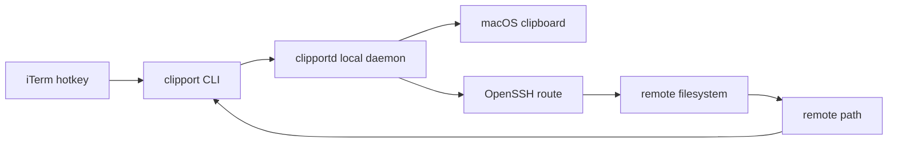
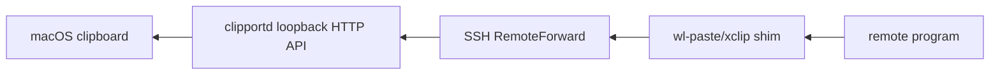
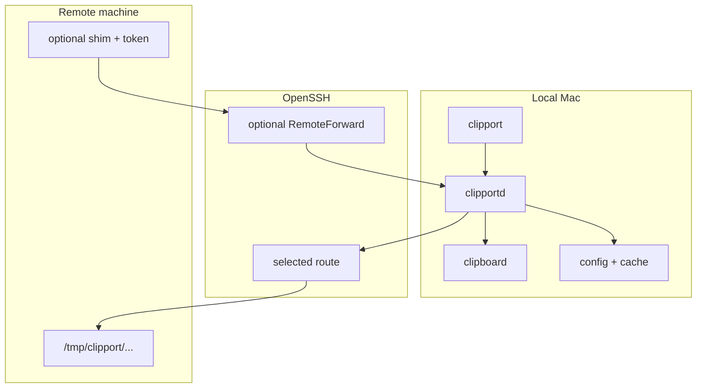

# Architecture

`clipport` does one narrow thing: it turns a clipboard image on the local Mac
into a file on the right remote filesystem, then returns the remote path.

The shape is intentionally boring:

- a small CLI for terminal and hotkey integration
- a local daemon for clipboard access, session lookup, route choice, and upload
- OpenSSH for transport
- optional remote shims for programs that expect `wl-paste` or `xclip`

The CLI stays thin because terminal hotkeys should be predictable. The daemon
owns state because clipboard reads, active-session mapping, and route cache are
local-machine concerns.

## Overview

### System shape

## Flows

### Main paste path

This is the core path.

1. iTerm runs `clipport paste-image`.
2. The CLI asks `clipportd` over a local Unix socket.
3. The daemon reads the macOS clipboard through `pngpaste`.
4. The daemon resolves the active iTerm session to a logical machine.
5. The daemon picks a healthy SSH route for that machine.
6. The daemon uploads bytes to `/tmp/clipport/...` on the remote filesystem.
7. The CLI prints the remote path.

`paste-image` is strict about stdout. On success, stdout is only the remote path.
That makes it safe to bind directly to a terminal hotkey or use in shell
composition.

### Optional shim path

The shim path exists for a different use case: remote programs that call
`wl-paste` or `xclip` and expect clipboard bytes on stdout.

Instead of copying secrets into scripts or exposing a broad service, the remote
shim forwards a narrow request back to the local daemon through an SSH
`RemoteForward`.

The HTTP API only binds to loopback. The remote shim token lives on the remote
machine at `~/.config/clipport/token` with `0600` permissions.

## Operating model

### Boundaries

- Local daemon boundary: clipboard access, session mapping, route cache, and
  uploads stay on the Mac.
- SSH boundary: connection behavior stays in OpenSSH, including `Port`,
  `ProxyJump`, `ProxyCommand`, and `ControlMaster`.
- Remote boundary: uploaded files stay under `/tmp/clipport/...`; shim tokens
  stay in `~/.config/clipport/token`.
- Output boundary: `paste-image` writes only the remote path to stdout.

### Route model

A machine is a remote filesystem.

A route is one SSH path to that filesystem.

This distinction matters because the same machine may be reachable in several
ways: LAN alias, public alias, jump host, or any other OpenSSH configuration.

Routes are tried by ascending `priority`. Route probing uses SSH semantics, so
SSH config features such as `Port`, `ProxyJump`, `ProxyCommand`, and
`ControlMaster` stay in OpenSSH's control.

`clipport` does not keep its own SSH connection pool. Fast repeated uploads
come from two simpler mechanisms:

- cached route choice
- OpenSSH connection reuse

### Design bias

The architecture prefers small contracts over cleverness:

- no custom SSH transport
- no daemon exposed beyond loopback
- no token embedded in executable remote scripts
- no config knobs unless there is a concrete use case
- no extra stdout from `paste-image`
